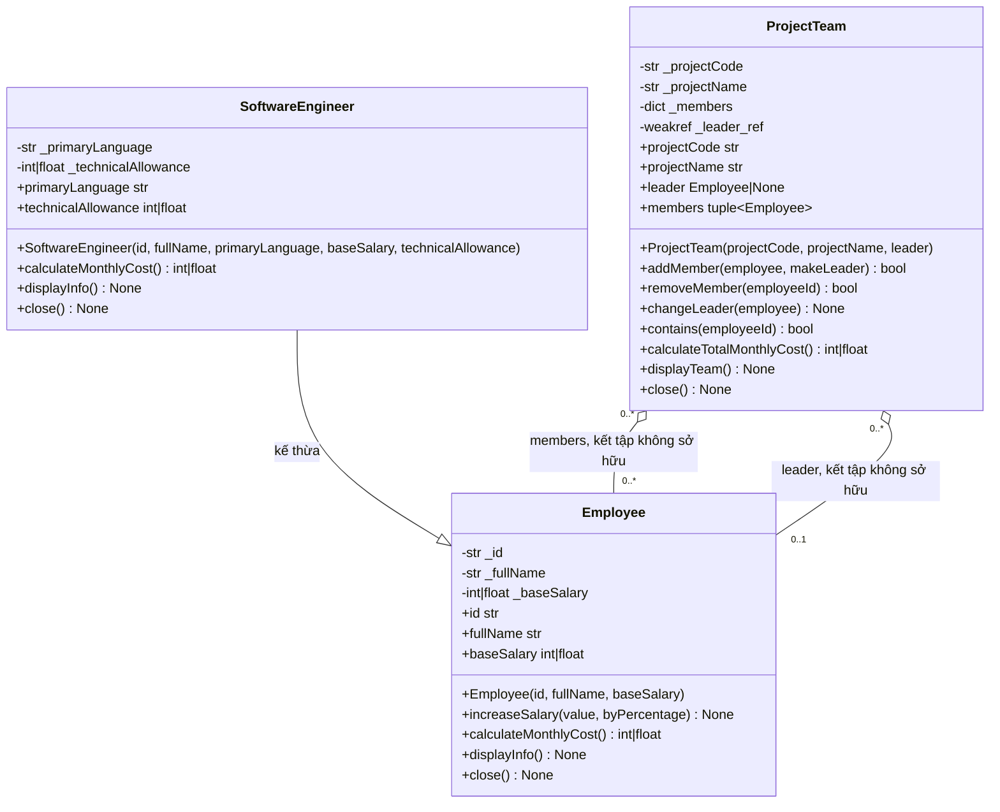

# Phân tích và thiết kế: Nhóm dự án và nhân sự

## Đối chiếu đề gốc

Đề trong `Lab03-04-overloading.pdf` gồm ba phần: A phân tích và thiết kế ba lớp, các quan hệ và bất biến; B cài đặt `Employee`, `SoftwareEngineer`, `ProjectTeam`, nạp chồng constructor/phương thức, đa hình và quan sát vòng đời; C trình diễn 15 bước kiểm thử. Bài làm giữ các yêu cầu nghiệp vụ đó, đồng thời bổ sung kiểm tra dữ liệu và quy tắc định danh theo yêu cầu triển khai.

## Trách nhiệm và API

### Employee

- Trách nhiệm: lưu mã, họ tên, lương cơ bản; kiểm tra dữ liệu; tăng lương; cung cấp chi phí tháng và thông tin.
- Thuộc tính chỉ đọc: `id`, `fullName`, `baseSalary`.
- Constructor Python: `Employee(id="UNKNOWN", fullName="Unnamed employee", baseSalary=0)`. Cho phép khởi tạo mặc định, hai tham số hoặc đủ ba tham số.
- Phương thức: `increaseSalary(value, byPercentage=False)`, `calculateMonthlyCost()`, `displayInfo()`, `close()`.
- `increaseSalary(value)` là tăng cố định; `increaseSalary(value, True)` tăng theo phần trăm. Giá trị phải dương.

### SoftwareEngineer

- Trách nhiệm: biểu diễn một kỹ sư và chi phí kỹ thuật bổ sung.
- Kế thừa `Employee`; thuộc tính chỉ đọc thêm: `primaryLanguage`, `technicalAllowance`.
- Constructor Python theo thứ tự: `SoftwareEngineer(id, fullName, primaryLanguage, baseSalary=0, technicalAllowance=0)`. Dạng rút gọn truyền ba tham số đầu; dạng đầy đủ truyền cả năm. Python dùng tham số mặc định trong một constructor, không định nghĩa hai constructor trùng tên.
- Ghi đè `calculateMonthlyCost()` thành lương cơ bản cộng phụ cấp; ghi đè `displayInfo()` để hiện ngôn ngữ và phụ cấp.
- `close()` ghi nhận vòng đời lớp dẫn xuất trước rồi gọi `Employee.close()`.

### ProjectTeam

- Trách nhiệm: quản lý trưởng nhóm và tập thành viên, duy trì tính duy nhất, tính chi phí và hiển thị nhóm.
- Thuộc tính chỉ đọc: `projectCode`, `projectName`, `leader`, `members` (`members` trả về tuple để không lộ cấu trúc nội bộ).
- Constructor Python: `ProjectTeam(projectCode, projectName, leader=None)`. Bỏ qua `leader` để tạo nhóm chưa có trưởng nhóm; nếu được truyền, người đó tự động được thêm đúng một lần.
- Phương thức: `addMember(employee, makeLeader=False)`, `removeMember(employeeId)`, `changeLeader(employee)`, `contains(employeeId)`, `calculateTotalMonthlyCost()`, `displayTeam()`, `close()`.
- `addMember` trả `True` khi thêm mới và `False` khi chính đối tượng đó đã là thành viên. Trường hợp đối tượng khác trùng mã bị từ chối bằng `ValueError`.

## Bất biến và cách bảo đảm

- Mã, họ tên, ngôn ngữ, mã dự án và tên dự án sau khi bỏ khoảng trắng đầu/cuối không được rỗng.
- Lương cơ bản và phụ cấp không âm; số tiền tăng lương phải dương. Số không hữu hạn và giá trị sai kiểu cũng bị từ chối.
- Getter dùng `property` không có setter; mọi dữ liệu đầu vào được xác thực trước khi ghi.
- Mỗi nhóm lưu thành viên theo mã trong dictionary nên một mã chỉ có một vị trí. Nếu mã đã có nhưng đối tượng khác, thao tác bị từ chối.
- Thêm lại đúng đối tượng không chèn thêm lần nữa; nếu đặt `makeLeader=True`, chỉ thay vai trò trưởng nhóm.
- Trưởng nhóm nếu có luôn được thêm vào danh sách. Đổi trưởng nhóm không xóa người cũ; trưởng nhóm mới chưa có thì được thêm.
- Không xóa trưởng nhóm hiện tại trước khi đổi sang người khác. Thao tác bị từ chối không làm đổi trưởng nhóm hay danh sách thành viên.
- Tổng chi phí duyệt mỗi thành viên đúng một lần và gọi `calculateMonthlyCost()` đa hình. Trưởng nhóm không có bản ghi riêng thứ hai.
- Các thao tác nhận dữ liệu không hợp lệ kiểm tra đối số và xung đột trước khi sửa trạng thái.

## Kết tập và vòng đời

`ProjectTeam` chỉ giữ `weakref.ref` đến `Employee`, không giữ quyền sở hữu. Vì vậy một nhân sự có thể ở nhiều nhóm; phần chương trình bên ngoài phải giữ tham chiếu mạnh đến nhân sự trong thời gian nhóm cần dùng. Nhóm tự loại tham chiếu yếu đã hết hiệu lực ở lần truy cập tiếp theo; nếu trưởng nhóm đã hết hiệu lực thì trạng thái trưởng nhóm trở về `None`.

Python không có destructor xác định tương đương hoàn toàn với destructor C++: `del ten_bien` xóa một binding/tham chiếu, không phải lệnh hủy đối tượng; `__del__` có thể chạy muộn hoặc không chạy đúng lúc dự đoán do cơ chế thu gom rác và chu trình tham chiếu. Bài làm không dùng `__del__` để bảo đảm quy tắc nghiệp vụ. Thay vào đó, `close()` phát thông báo vòng đời tường minh và đóng riêng cấu trúc nhóm; `ProjectTeam` cũng hỗ trợ `with` để gọi `close()` khi rời khối một cách xác định. Đóng nhóm không gọi `close()` trên nhân sự. Các lớp nhân sự có `close()` tường minh để quan sát vòng đời, tương tự ý nghĩa minh họa của thông báo destructor trong đề.

## Nạp chồng, ghi đè và chuyển đổi C++ sang Python

- C++ cho phép nhiều constructor/phương thức trùng tên với danh sách tham số khác nhau. Python không hỗ trợ overload theo chữ ký khi chạy; bài làm dùng giá trị mặc định cho constructor và tham số `byPercentage` cho `increaseSalary`/`makeLeader`.
- `SoftwareEngineer.calculateMonthlyCost()` và `displayInfo()` là ghi đè (override): lớp dẫn xuất thay hành vi lớp cơ sở. Đây là đa hình động khi nhóm gọi phương thức trên từng `Employee`.
- Python không có từ khóa `virtual`/`override` bắt buộc; phương thức lớp cơ sở có thể được ghi đè trực tiếp.
- Python không có cơ chế hủy đối tượng xác định như destructor C++; `close()` và context manager là cách tường minh để thể hiện thông báo/đóng tài nguyên.

## Quy ước bổ sung

- Chuỗi được loại khoảng trắng đầu/cuối trước khi lưu; mã được so khớp phân biệt hoa thường.
- Số nhận là `int` hoặc `float`, từ chối `bool`, NaN và vô cực.
- Dự án phải có mã và tên không rỗng. Thành viên thêm trùng chính đối tượng trả `False`; dữ liệu sai kiểu gây `TypeError`, vi phạm giá trị/nghiệp vụ gây `ValueError`.
- Sau `ProjectTeam.close()`, các thao tác đọc/ghi nhóm gây `RuntimeError`; gọi `close()` lần nữa không phát lặp thông báo.

## UML

`leader` có bội số `0..1` ở phía nhân sự: đề cho phép một nhóm chưa có trưởng nhóm. Mỗi nhóm có không quá một trưởng nhóm; một nhân sự có thể tham gia nhiều nhóm.